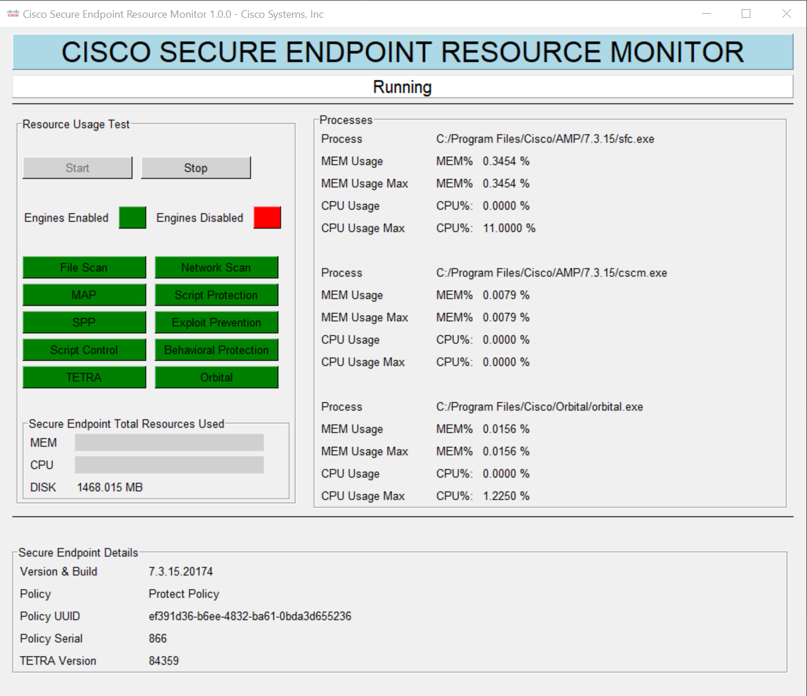

# CiscoSecureEndpointResourceMonitor

This program is being designed for customers to use on their own.  
The goal is to demonstrate the resources typically used by the Cisco Secure Endpoint product under a simulated load.
Stress testing can be done independently when the program is running.  

